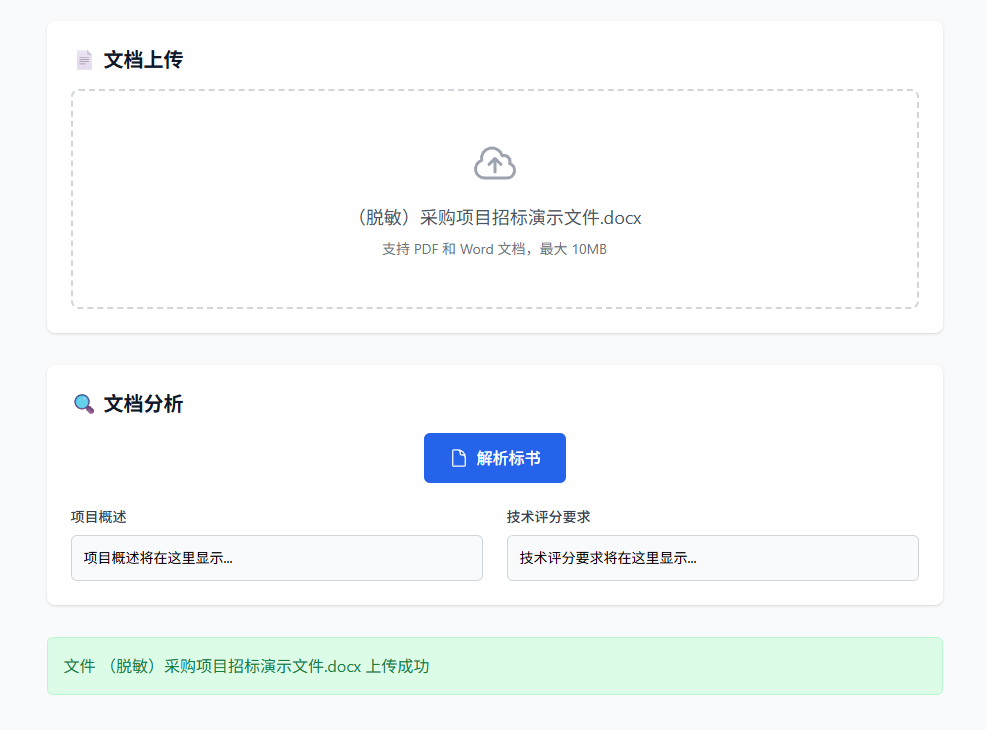
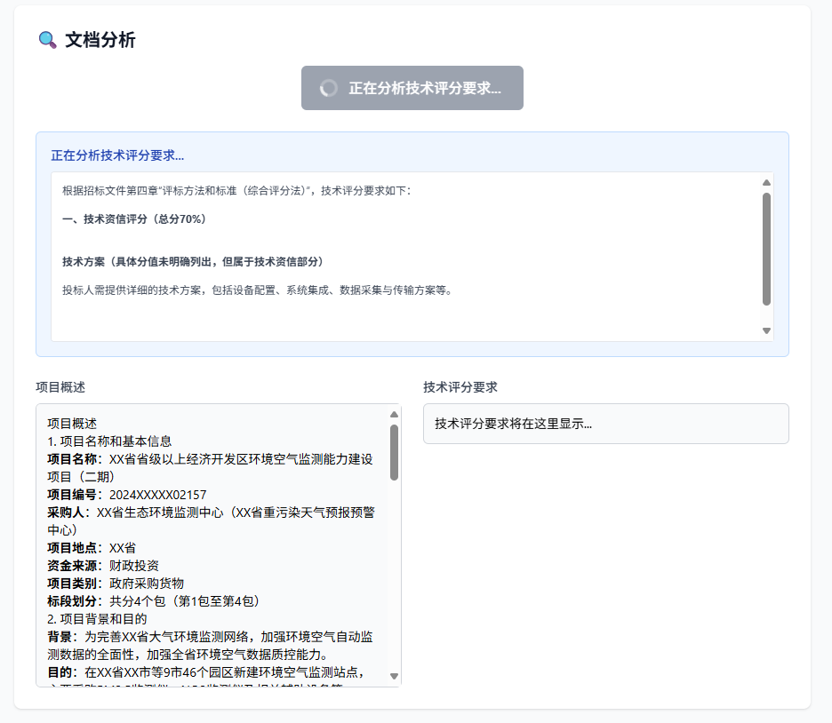

# 易标极速版 - AI智能标书写作助手

<p align="center">
  
  
  
  
</p>


<p align="left">
  <strong>🚀 基于 AI 的智能标书写作助手，让标书制作变得简单高效</strong>
</p>


### ✨ 核心功能

- **🤖 智能文档解析**：自动分析招标文件，提取关键信息和技术评分要求
- **📝 AI生成目录**：基于招标文件智能生成专业的三级标书目录结构  
- **⚡ 内容自动生成**：为每个章节自动生成高质量、针对性的标书内容
- **🎯 个性化定制**：支持***自定义AI模型***
- **💾 一键导出**：导出word，自由编辑

### 🌟 产品优势

- ⏱️ **效率提升**: 将传统需要数天的标书制作缩短至几小时
- 🎨 **专业质量**: AI生成的内容结构清晰、逻辑严密、符合行业标准
- 🔧 **易于使用**: 简洁直观的界面设计，无需专业培训即可上手
- 🔄 **持续优化**: 基于用户反馈不断改进AI算法和用户体验

## 🌐 官方网站

**在线体验**: [https://yibiao.pro](https://yibiao.pro)

获取更多产品信息、在线体验和技术支持。

## 📦 使用说明

### 💻 系统要求

- Windows 10/11 (64位)
- 至少 4GB 内存
- 100MB 可用磁盘空间

### ⬇️ 下载安装

1. **直接下载**：从 [GitHub Releases](https://github.com/yibiaoai/yibiao-simple/releases) 下载最新版本的exe文件
2. **运行程序**：双击 `yibiao-simple.exe` 即可启动应用
3. **配置AI**：首次使用需要配置API Key密钥（推荐DeepSeek）


### 📝 使用流程

1. **📌 配置AI**：支持所有openai like的大模型，推荐DeepSeek  
  
2. **📄 文档上传**：上传招标文件（支持Word和PDF格式）  
  
3. **🔍 文档分析**：AI自动解析招标文件，提取项目概述和技术要求  
  
4. **📋 生成目录**：基于分析结果智能生成标书目录结构  
  
5. **✍️ 生成正文**：为各章节生成内容，多线程并发，极速体验  
  
6. **📤 导出标书**：一键导出完整的标书文档  
  

## 🛠️ 技术架构

### 架构设计

采用现代化的**前后端分离架构**，确保高性能和良好的用户体验：

- **前端**: React + TypeScript + Tailwind CSS
- **后端**: FastAPI + Python
- **AI集成**: OpenAI SDK
- **部署**: PyInstaller 单文件打包


### 🏗️ 项目结构

```
易标极速版/
├── 📁 backend/                 # 后端服务
│   ├── 📁 app/
│   │   ├── main.py            # FastAPI应用入口
│   │   ├── config.py          # 应用配置
│   │   ├── 📁 routers/        # API路由模块
│   │   ├── 📁 services/       # 业务逻辑服务  
│   │   └── 📁 models/         # 数据模型
│   └── requirements.txt       # Python依赖
├── 📁 frontend/               # 前端应用
│   ├── 📁 src/
│   │   ├── 📁 components/     # 可复用组件
│   │   ├── 📁 pages/          # 页面组件
│   │   ├── 📁 services/       # API服务
│   │   └── 📁 hooks/          # React Hooks
│   └── package.json           # 前端依赖
├── single_port.bat            # 一键启动脚本
├── build.py                   # 打包脚本
└── README.md                  # 项目文档
```


## 🚀 参与开发

### 开发环境运行

```bash
# 克隆项目
git clone https://github.com/yibiaoai/yibiao-simple.git
cd yibiao-simple

# 一键启动
./single_port.bat

```

### 生产环境打包

```bash
# 一键构建exe
python build.py

# Windows批处理脚本
build.bat
```

构建完成后，exe文件位于 `dist/yibiao-simple.exe`

## 📚 API文档

启动应用后访问 `http://localhost:8000/docs` 查看完整的FastAPI自动生成的API文档。


## 📌代办任务
- [ ] 录入预期字数

## 🤝 贡献指南

欢迎各种形式的贡献！

1. **🐛 问题反馈**: 在 [Issues](https://github.com/yibiaoai/yibiao-simple/issues) 中报告bug
2. **💡 功能建议**: 提出新功能需求和改进建议  
3. **🔧 代码贡献**: Fork项目，提交Pull Request
4. **📖 文档完善**: 帮助改进文档和使用说明


## 📄 许可证

本项目基于 [MIT License](LICENSE) 开源协议发布。

## 🙋‍♂️ 联系我们

- **官方网站**: [https://yibiao.pro](https://yibiao.pro)
- **问题反馈**: [GitHub Issues]((https://github.com/yibiaoai/yibiao-simple/issues)
- **邮箱联系**: support@yibiao.pro

---

<p align="center">
  ⭐ 如果这个项目对您有帮助，请给我们一个Star支持！
</p>


<p align="center">
  Made with ❤️ by 易标团队 
</p>